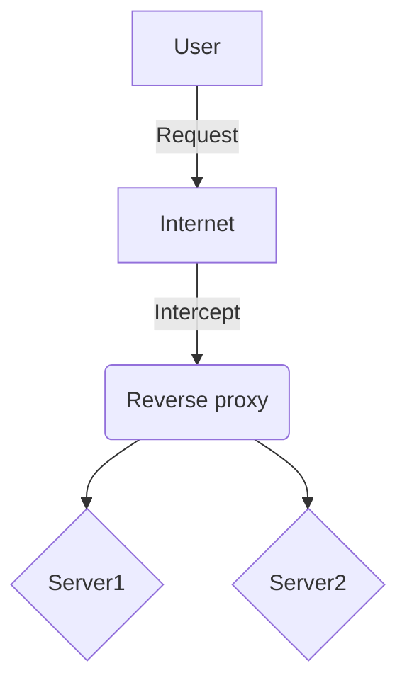
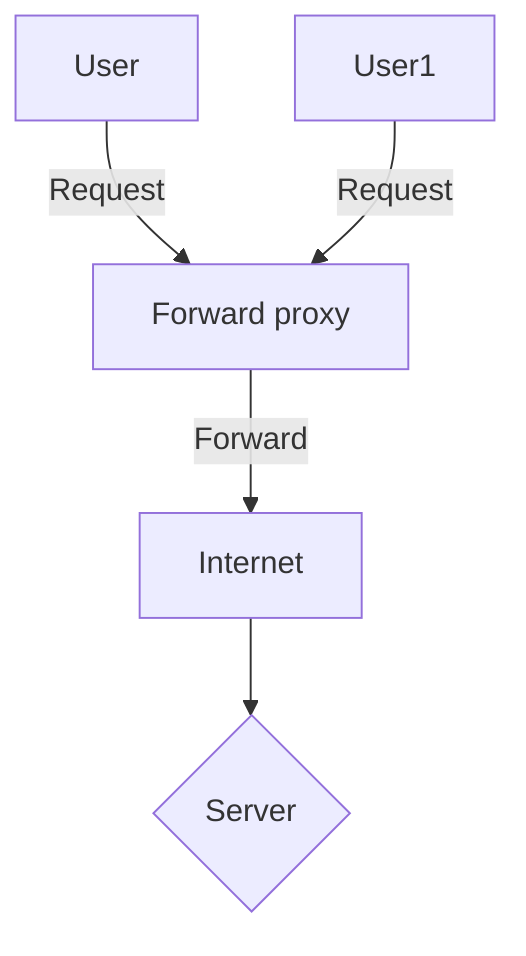

# Revesrse Proxy Notes

## Links
Links to places(headers) in the document
- [Revesrse Proxy Notes](#revesrse-proxy-notes)
  - [Links](#links)
  - [Questions](#questions)
  - [Reverse Proxy Configuration guide](#reverse-proxy-configuration-guide)
_____


## Questions


>>**What is a reverse proxy? Why implement one?**
>
>>A service, server or app that sits in-front of other servers that catches and inpects incoming requets before forwarding them to the web server and then returning the server's response.
>
>>**Why are they useful?:**
>* Improve Security: Hides backend servers IP addresses, can implement SSL/TLS encryption, Blocks malicious requests and enforce security monitoring
>* Load Balancing: Can Distribute incoming traffic across multiple backend servers to prevent overloading and ensure high availability.
>* Caching: can store frequently accesed content and improve response times for those resources.
>* Centralized Logging: Can log and montior all traffic from one enrty point.

>**How are they different to a forward proxy?**
>>* Sits in front of a client instead of the server's end points and ensures no servers communicate directly with the client.
>>* The Clients sends requests to the forward server and the server forwards it to the website.
>>* This allows the client to be hidden from websites.

>**How do they work?**
>
>>A user will send a request to the sever which will be redirected to the proxy server. If the proxy server permits the message it will pass them  along to the servers. The server will then return the response to the proxy which will then pass it back to the user.

**Reverse Diagram**


>>A user will send the request to the proxy server which will then forward the message to the server then forward the response it gets back to the user.


**Forward Diagram**



## Reverse Proxy Configuration guide 

>**1**. Before starting, check that the current app is working by visting the page at: `http://<Public-IP>:3000`


>**2**. In order to configure a reverse proxy, go into the terminal and type:  `sudo nano /etc/nginx/sites-available/default` to enter the nginx configuration file.

>**3**. To change the web path from `http://<Public-IP>:3000` to just `http://<Public-IP>` scroll down until you see the lines:
```bash
location / {
     try_files $uri $uri/ =404;
}
```
>Remove the line inside location and add the line: `proxy_pass http://<Public-IP>:3000/;`
**Example:**


>4. Finally save and exit the script and then run `sudo systemctl restart nginx` to update your configuration. Now when you type in `http://<Public-IP>` into your webpage it you should automatically be redirect to `http://<Public-IP>:3000` instead.


       


